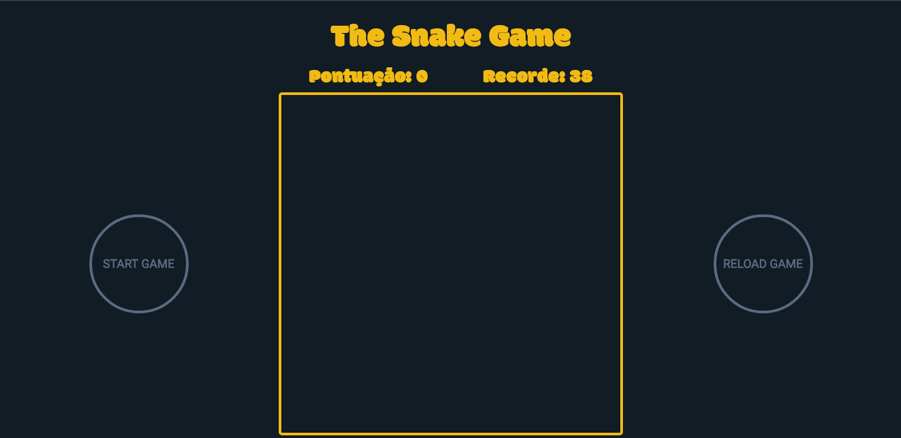

  

  #### Projeto- do Bootcamp HTML Web Developer da Digital Innovation One.
  Neste projeto criamos o clássico **Jogo da Cobrinha** em JavaScript durante o Bootcamp HTML Web Developer.
  Para a realização do projeto utilizamos **canvas**, resolvi adicionar alguns elementos extras como placar
  com a pontuação atual e o recorde utilizando **localStorage** para persistencia de dados no navegador, também
  foram adicionados botões de start e reload para dar mais controle a aplicação.
  
  
  
  

 

  

  Para acessar o projeto [clique aqui](https://michaelsribeiro.github.io/snakeGame/)

## Recursos

- **HTML 5** — Linguagem de Marcação utilizada para estruturar a página web
- **CSS** — Folha de estilo utilizada para definir a aparência.
- **JavaScript** — Linguagem de programação.

## Iniciando

1. Clone este  reposítório usando `git clone https://github.com/michaelsribeiro/snakeGame.git`
2. acesse a pasta do projeto via terminal com o comando: `cd snakegame` 

>É necessário ter instalado o [Yarn](https://yarnpkg.com/). Consulte formas de instalar no site oficial

### Iniciando a plataforma Web

1. Em uma nova aba do terminal, acesse a pasta: `cd snakegame`
2. Utilize o comando  `yarn` para instalar as dependẽncias 
3. Utilize o comando `yarn start` para iniciar a aplicação no seu navegador

***
